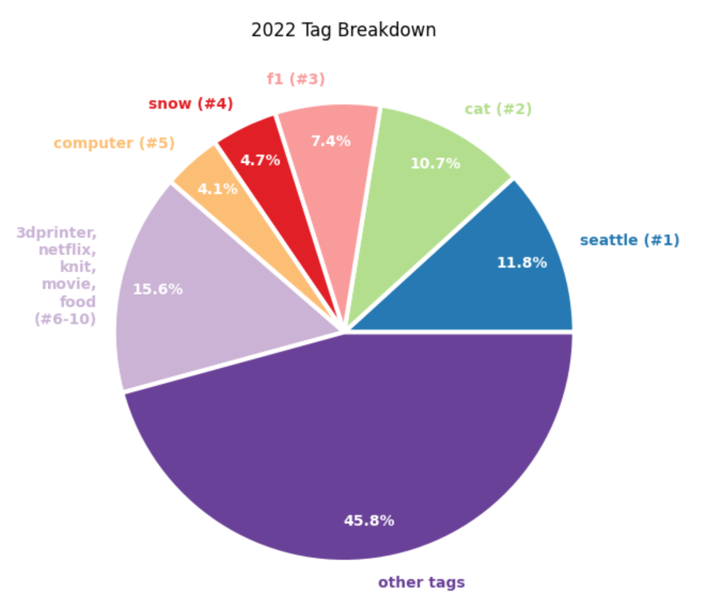

## Introduction
I embarked on a creative journey in late 2021 to document my daily experiences, using a custom-built [bash tool][bash-tool.link] I created for easy [one-second-a-day video][one-second.link] creation. As TikTok and YouTube Shorts gained popularity, I adapted my tool to create mobile-friendly versions and added support for content tags.

[bash-tool.link]: https://github.com/asolidum/dailyfla.sh
[one-second.link]: https://alansolidum.com/posts/daily-flash/#so-what-is-1-second-everyday

I was thrilled to have kept up this habit for over a year. With the videos and corresponding tags, join me in my self-discovery as I delve into the daily labels to uncover intriguing insights into my year.

You can see the data analysis in action on this [Deepnote Python notebook][deepnote.link].

[deepnote.link]: https://deepnote.com/@also/2022-Daily-Flash-Tag-Analysis-75d4af3c-5212-43c1-9bdd-e960c20bce71

## Setup
We need to pull the tags from our `dailyfla.sh` bash script (available on [github][github.link]).

In the script, we currently have arrays elements that look like the following:

```bash
filename[5]="input-2201/d0105_PXL_20220105_205624587.mp4"
timestamp[5]="00:00:00"
scale[5]=1166
offset[5]=0.585
tag[5]="work windowclean"

filename[6]="input-2201/d0106_PXL_20220106_204113678.mp4"
timestamp[6]="00:00:00"
scale[6]=1166
offset[6]=0.585
tag[6]="travel fly airplane"
```
For our analysis, we only need the tags. We'll pull the labels from the `bash` script using the following shell command:  `grep tag dailyfla.sh | grep ]= | awk -F= '{ gsub(/"/, "", $2); print $2 }' > 2022_dailyflash_tags.txt`

This results with a `2022_dailyflash_tags.txt` file with lines that look like:
```bash
work windowclean
travel fly airplane
```

## Import tag data from file
```python
tags_filename = './2022_dailyflash_tags.txt'

with open(tags_filename) as f:
    lines = f.readlines()

primary_tags = []
for line in lines:
    tags = line.strip().split(' ')
    primary_tag = tags[0]
    primary_tags += [primary_tag]
```

## Process primary tags
Each day can consist of multiple tags, and I've designated the first tag as the primary tag. This tag represents the best memorable aspect of that day.

For example, here's the thumbnail for Day 195.


This day has the following tags: `seattle pikeplace` since both can apply. However, the primary label used for our analysis is the first one, `seattle`. 

These primary tags will help determine how much my year was committed to engaging in particular activities.

```python
top_ten_totals = sum(i[1] for i in top_ten_primary_tags)
out = "Top Ten % - "+str(round((top_ten_totals/365)*100,2))+"%"
print(out)
for i in range(len(top_ten_primary_tags)):
    pct = (top_ten_primary_tags[i][1]/365)*100
    out = str(i+1)+'. '+top_ten_primary_tags[i][0]+' - '+str(round(pct,2))+'%'
    print(out)
```
### Output
```bash
Top Ten % - 54.25%
1. seattle - 11.78%
2. cat - 10.68%
3. f1 - 7.4%
4. snow - 4.66%
5. computer - 4.11%
6. 3dprinter - 4.11%
7. netflix - 3.56%
8. knit - 3.29%
9. movie - 2.47%
10. food - 2.19%
```

## Display the data visually
```python
x = [11.78, 10.68, 7.4, 4.66, 4.11, 4.11, 3.56, 3.29, 2.47, 2.19, 100-54.25]
labels = [ 'seattle', 'cat', 'f1', 'snow', 'computer', '3dprinter', 'netflix', 'knit', 'movie', 'food' , 'other' ]
colors = plt.get_cmap('Blues')(np.linspace(0.4, 0.9, len(x)))

# plot
fig, ax = plt.subplots(figsize=(7, 7))
ax.set_title('2022 Tag Breakdown')
patches, texts, pcts  = ax.pie(
    x, colors=colors, labels=labels,
    autopct='%.1f%%', pctdistance=.85,
    labeldistance=1.1,
    wedgeprops={"linewidth": .5, "edgecolor": "white"}, frame=False)
plt.setp(pcts, color='white', fontweight=600)

plt.show()
```



## Conclusion
Given I live in Seattle, having 11.8% of my days tagged there wasn't terribly surprising. Interestingly, almost 11% (about 39 days) had `cat` tags. While we don't have a cat of our own, we spend a lot of time cat-sitting. In retrospect, I guess it makes sense, given the general popularity of cat videos. It could also be a reflection of my own preference for incorporating cat content in my monthly uploads. My girlfriend's recent knitting hobby also made a surprise appearance on the list, coming in at 8th place, despite her taking up the activity in mid-September.

### Related Links
* [Daily Fla.sh Blog Post][blog.link]
* [Daily Fla.sh Git Repo][github.link]
* [My 2022 Daily Fla.sh YouTube Playlist][youtube-playlist.link]

[blog.link]: https://alansolidum.com/posts/daily-flash
[github.link]: https://github.com/asolidum/dailyfla.sh
[youtube-playlist.link]: https://www.youtube.com/watch?v=WNUWIJkNK2Y&list=PL2u0OXvqrDk3LEK55fGMiaIBTp5oph898
