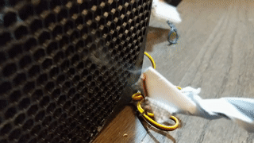

Some of my latest projects require soldering electronic circuits that can emit noxious fumes during that process.  Excessive inhalation of these emissions is a common concern especially in poorly ventilated workspaces such as mine.  To remedy this issue, some people use solder fume extractors to capture the harmful smoke.

After researching some online DIY examples like this [Instructables post](https://www.instructables.com/DIY-Fume-Extractor-for-5) or this [YouTube video](https://www.youtube.com/watch?v=tibb_jtpTpk), I concluded that most DIY fume builds are composed of three basic components: a filter, a fan, and a housing (and in our case, fabricated with a 3D printer and inexpensive filament).

## The Build

### The Filter

Last year, I bought a [set of 10 charcoal filters](https://www.worldmarket.com/product/compost-charcoal-filters.do) for our compost bucket. Shortly after that, we moved into an apartment complex that surprisingly provides in-house compost services. Thus, we can repurpose these filters for our build.

### The Fan

With my trusty digital calipers, I measured the diameter of the carbon filter to be ~140mwm.  After a quick search online, I found this inexpensive [fan](https://www.amazon.com/gp/product/B014PXH2U8) on Amazon that perfectly suited our filters.

### The Housing

Our housing should fulfill some basic requirements:
* Be inexpensive and easy to assemble/build
* Protect the fan blades from debris
* Support easy filter replacement



Attaching the filter as close as possible to the fan should simplify our design.  I found this [Customizable Fan Grill Cover](https://www.thingiverse.com/thing:2802474) 3d model on [Thingiverse](https://www.thingiverse.com) that provides both fan protection and a clever way to mount our filter next to the fan.  Not to mention, we'll only need to deal with 4 screws to assemble this build and change out the filter.  Looks like we've fulfilled our 3 basic requirements! :satisfied::white_check_mark:

The SCAD file contains one key variable (`cover height in millimeter`) that is significant for our build.  We will match the housing height to the height of the compost filter (~8mm). By adjusting this value, we now have an inlay in our fan cover to perfectly fit our charcoal filter.

Here are the settings, I used for my particular filter and fan setup.



After mounting all the parts, I tested the assembly to make sure it was indeed absorbing the fumes. :fireworks::clap:

## Final Thoughts

This build was a proof of concept to validate seamless integration of all the parts.  However, the fume extractor's performance was less than desirable likely stemming from the fan's low airflow rating (58 CFM).  Any future updates should benefit from a higher CFM value fan.

It also goes without saying that without the customizable SCAD model, we couldn't have easily imagined this creative solution.  Special thanks to the fan cover model creator, [@mightynozzle](https://www.thingiverse.com/mightynozzle/designs) (Dennis H).

...And this is yet another reminder that I need to learn SCAD so I can create my own models.
